# Assignment 1: Algorithm Metrics and Analysis

## Architecture Notes

This project implements and benchmarks several classic algorithms: **MergeSort**, **QuickSort** (robust), **Deterministic Select** (Median-of-Medians), and **Closest Pair of Points** (2D). Each algorithm is instrumented with a **Metrics** class that tracks:

- **Comparisons:** Number of key comparisons.

- **Allocations:** Number of significant array/object allocations.

- **Recursion Depth:** Maximum stack depth reached.

- **Elapsed Time:** Wall-clock time in nanoseconds.

Metrics are collected by passing a Metrics object to each algorithm. Recursion depth is tracked by incrementing on entry and decrementing on exit of recursive calls. Allocations are incremented for each major array or buffer allocation. All metrics are written to CSV files for later analysis.

## Recurrence Analysis

### MergeSort

- **Recurrence:** T(n)=2T(n/2)+Θ(n) (divide and merge steps)

- **Master Theorem:** a=2,b=2,f(n)=Θ(n)⇒T(n)=Θ(nlogn)  

- **Depth:** Each recursive call splits the array in half, so the maximum recursion depth is Θ(logn).

- **Notes:** The cutoff to insertion sort for small subarrays improves constant factors due to better cache locality.

### QuickSort (Robust)

- **Recurrence:** T(n)=T(small)+T(large)+Θ(n) (partitioning), with randomized pivot and always recursing on the smaller partition.

- **Expected Depth:** By always recursing on the smaller side and iterating on the larger, stack depth is bounded by Θ(logn).

- **Master Theorem:** Average-case T(n)=2T(n/2)+Θ(n)⇒Θ(nlogn), but worst-case is avoided by randomization and robust partitioning.

- **Notes:** Randomized pivot and tail recursion optimization reduce stack usage and improve robustness.

### Deterministic Select (Median-of-Medians)

- **Recurrence:** T(n)≤T(⌈n/5⌉)+T(7n/10)+Θ(n) (grouping, median finding, partitioning)

- **Akra–Bazzi:** Yields T(n)=Θ(n)  

- **Depth:** Recursion is always on the smaller side, so stack depth is O(logn).

- **Notes:** The algorithm guarantees linear time and bounded stack depth, but with a higher constant factor than randomized selection.

### Closest Pair of Points (2D)

- **Recurrence:** T(n)=2T(n/2)+Θ(n) (divide, conquer, and merge with strip check)

- **Master Theorem:** a=2,b=2,f(n)=Θ(n)⇒T(n)=Θ(nlogn)  

- **Depth:** Recursion depth is Θ(logn).

- **Notes:** The “strip” check leverages sorting by y-coordinate for efficiency; cache effects are significant for large n.

## Plots

### Time vs n

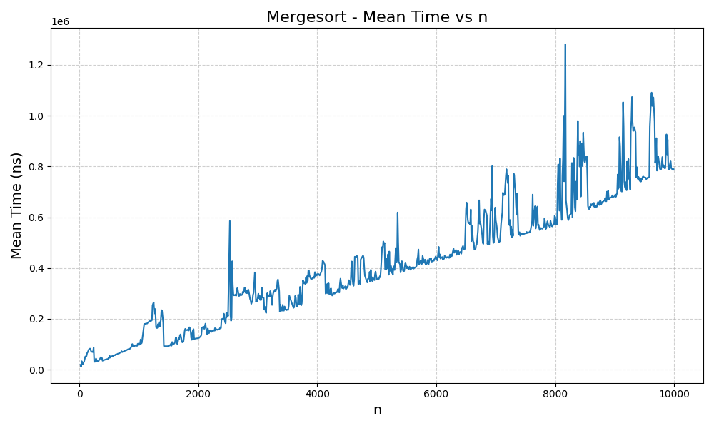
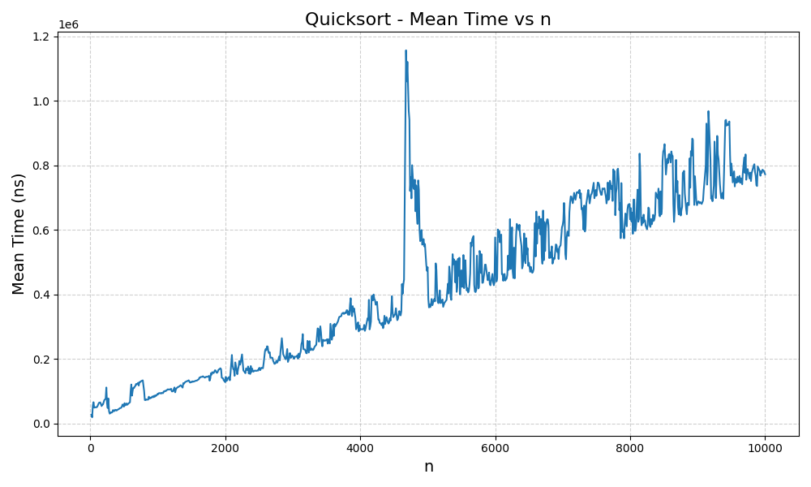
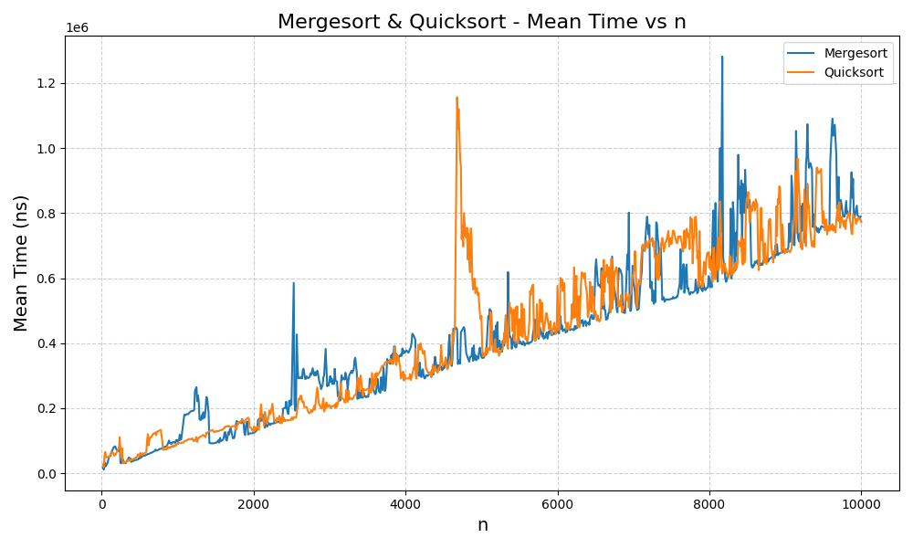
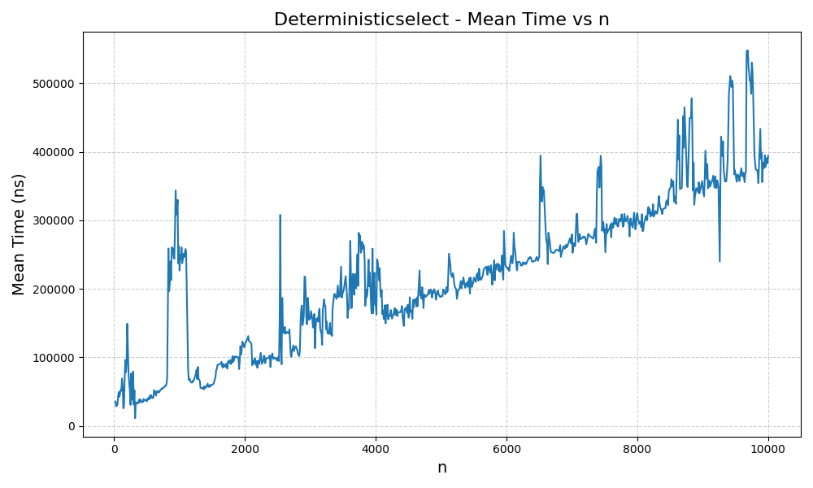
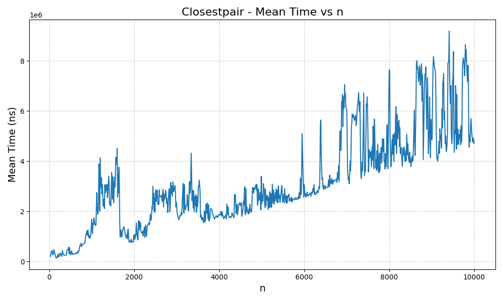
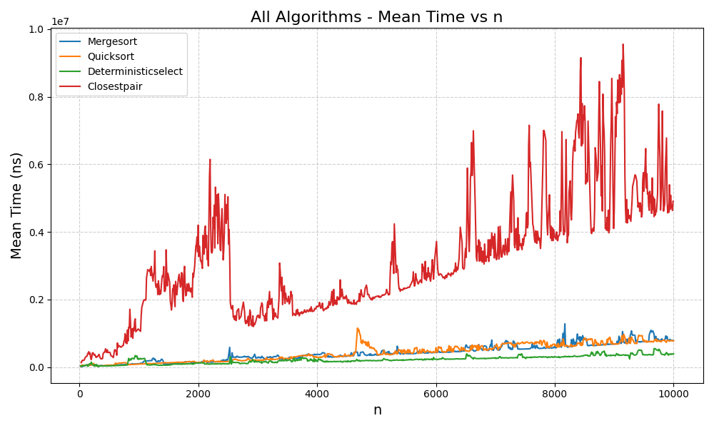

### Depth vs n

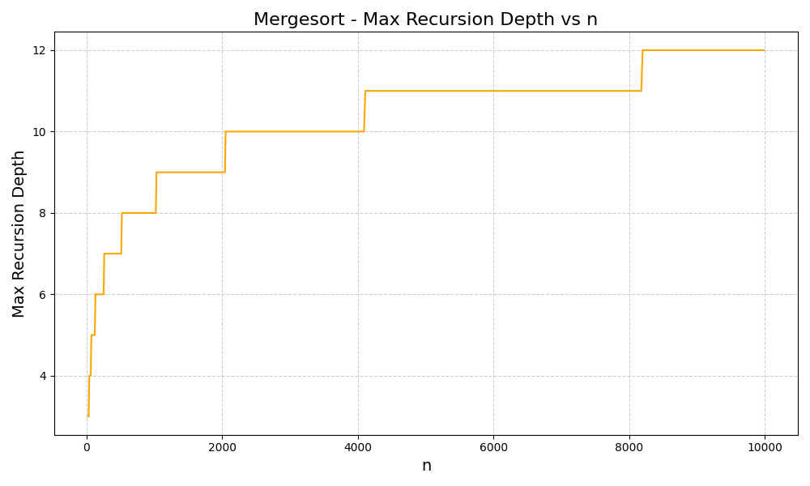
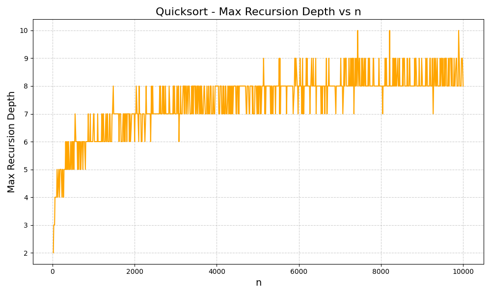
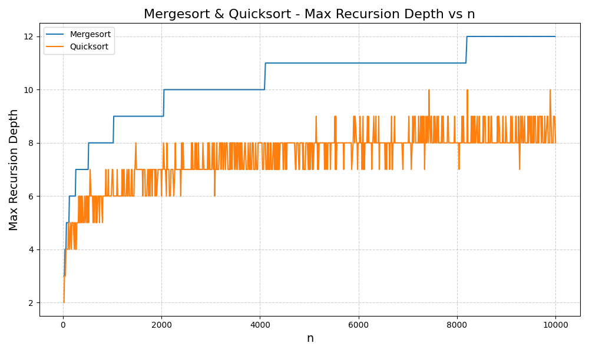
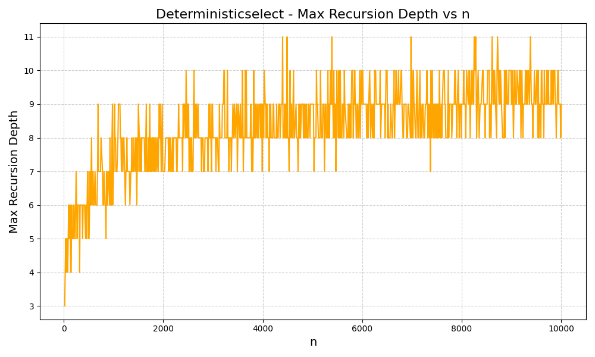
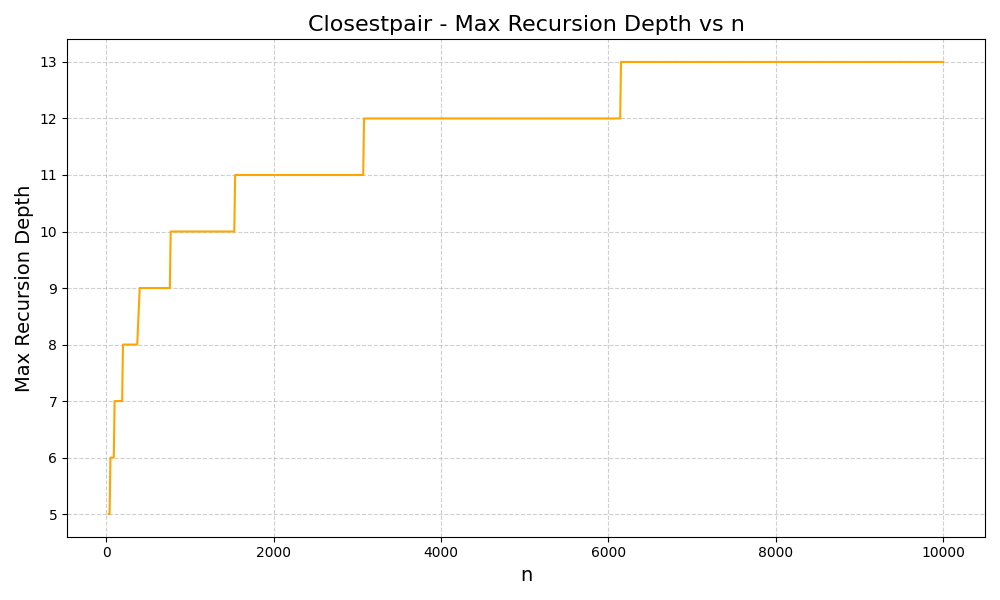
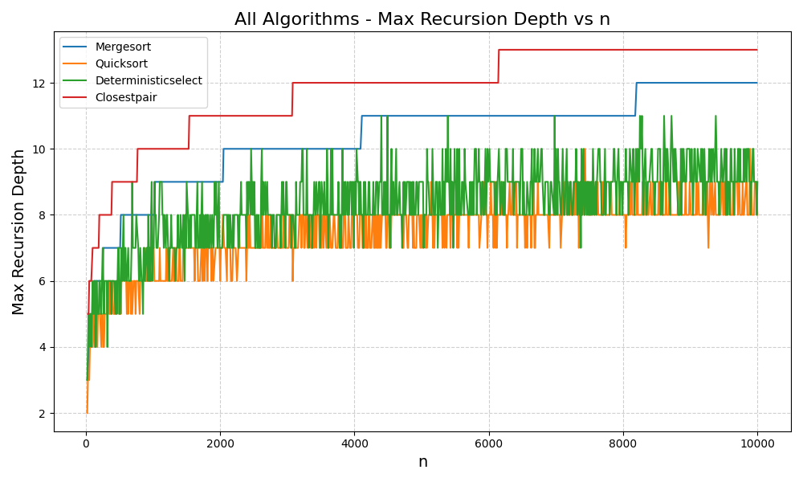


## Constant-Factor Effects

- **Cache:** Algorithms with better locality (e.g., insertion sort for small n, merge buffers) show improved real-world performance.

- **Garbage Collection:** Excessive allocations (e.g., in median-of-medians) can trigger GC pauses, affecting timing.

- **Implementation Details:** Cutoffs to simpler algorithms (like insertion sort) and in-place operations reduce overhead.

## Summary: Theory vs Measurement

- **Alignment:** The measured time and depth curves closely follow theoretical predictions (Θ(nlogn) for sorting, Θ(n) for selection).

- **Mismatches:** For small n, constant factors and JVM warmup dominate. For large n, cache and memory effects can cause deviations from ideal scaling.

- **Takeaway:** Theoretical analysis predicts the shape of the curves, but real-world performance is influenced by low-level details and system effects.

## CLI Usage Guide

The project provides dedicated CLI tools for each algorithm in the `org.example.cli` package and metrics runners in the `org.example.metrics` package. Each can be run after building the project.

### 1. Compile the Project

If using Maven:

```sh
mvn clean package
```

### 2. Run Algorithms and Get Results

#### MergeSort

```
java -cp target/classes org.example.algorithms.cli.MergeSortCli --n <size> [--out <file>] [--metrics <csvfile>]
java -cp target/classes org.example.algorithms.cli.MergeSortCli --array <comma-separated> [--out <file>] [--metrics <csvfile>]
```

- `--n <size>`: Generate a random array of given size
- `--array <comma-separated>`: Use a specific array (e.g., 5,3,8,1)
- `--out <file>`: (optional) Write the sorted array to a file (otherwise prints to terminal)
- `--metrics <csvfile>`: (optional) Write metrics for the run to a CSV file

#### QuickSort

```
java -cp target/classes org.example.algorithms.cli.QuickSortCli --n <size> [--out <file>] [--metrics <csvfile>]
java -cp target/classes org.example.algorithms.cli.QuickSortCli --array <comma-separated> [--out <file>] [--metrics <csvfile>]
```

#### Deterministic Select

```
java -cp target/classes org.example.algorithms.cli.DeterministicSelectCli --n <size> [--k <order>] [--out <file>] [--metrics <csvfile>]
java -cp target/classes org.example.algorithms.cli.DeterministicSelectCli --array <comma-separated> [--k <order>] [--out <file>] [--metrics <csvfile>]
```

- `--k <order>`: (optional) Order statistic to select (default: median)
- Prints or writes the k-th smallest value
- `--metrics <csvfile>`: (optional) Write metrics for the run to a CSV file

#### Closest Pair

```
java -cp target/classes org.example.algorithms.cli.ClosestPairCli --n <size> [--out <file>] [--metrics <csvfile>]
java -cp target/classes org.example.algorithms.cli.ClosestPairCli --points <x1,y1;x2,y2;...> [--out <file>] [--metrics <csvfile>]
```

- `--points <x1,y1;x2,y2;...>`: Use specific 2D points (semicolon-separated)
- Prints or writes the closest pair distance
- `--metrics <csvfile>`: (optional) Write metrics for the run to a CSV file

### 3. Run Metrics Runners

Metrics runners are in the `org.example.metrics` package. Example:

```
java -cp target/classes org.example.metrics.MergeSortMetricsRunner
java -cp target/classes org.example.metrics.QuickSortMetricsRunner
java -cp target/classes org.example.metrics.DeterministicSelectMetricsRunner
java -cp target/classes org.example.metrics.ClosestPairMetricsRunner
```

### 4. Get Help

Each CLI supports `--help` to print usage instructions and options.
